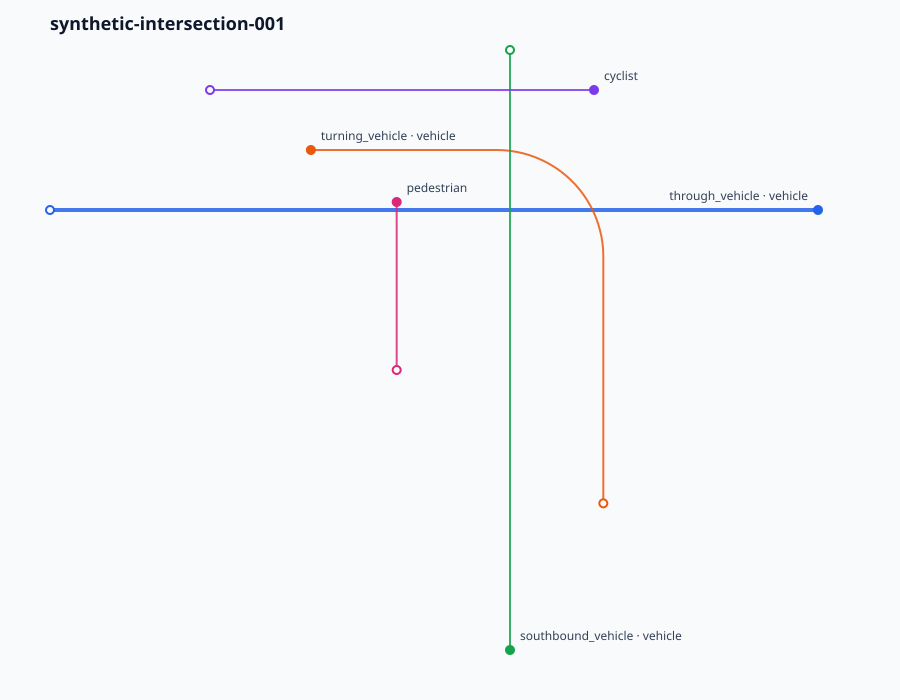
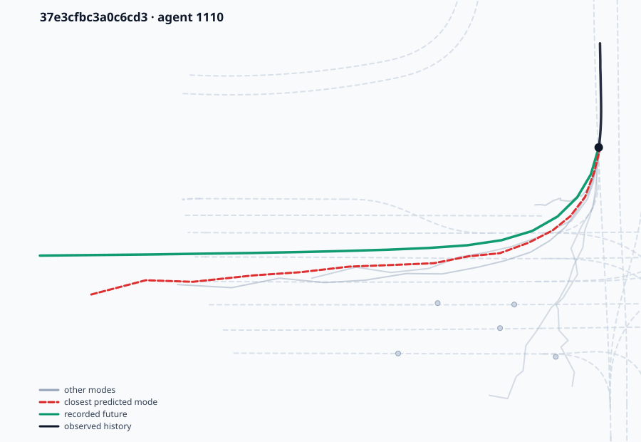

# Trajectory Verification System

[](https://github.com/IamTemmy/trajectory-verification-system/actions/workflows/ci.yml)

**Evaluate motion-prediction models the way safety-critical software is evaluated,
not the way leaderboard entries are.**

A requirements-driven engineering toolkit for verifying recorded or generated
autonomous-driving trajectories, localizing failures in time, and producing
traceable evidence.

The first dataset adapter targets the Waymo Open Motion Dataset (WOMD). This project evaluates trajectories contained in or supplied alongside public datasets; it does **not** evaluate or make claims about the production Waymo Driver.

## Why this project exists

Motion-prediction benchmarks compress performance into an aggregate displacement
error. A single mean tells you a model is some number of metres off on average. It
does not tell you which situations it failed, or whether those situations mattered.

Engineering validation has to answer questions an aggregate cannot:

- Which behavioral requirement failed?
- When did it fail, to the sample?
- Which agents and derived signals support that conclusion?
- How sensitive is the verdict to the chosen threshold?
- Did a new model version regress something the previous one handled?
- Did the failure happen somewhere consequential — near a crosswalk, a traffic
  control, or another actor?

This repository is built around those questions. Its output is evidence, not a score.

## See it work



A synthetic four-way junction: a turning vehicle cuts across a through
vehicle's path while a southbound vehicle, a cyclist and a pedestrian move
nearby. Nothing here is dataset-derived, so it runs with no download and no
credentials:

```bash
verify-trajectories \
  examples/intersection_scenario.json \
  examples/intersection_requirements.json \
  --markdown-report report.md \
  --svg-output scenario.svg
```

The command exits `1` and writes [this evidence report](docs/examples/intersection-report.md).
It does not report that the scenario failed. It reports which requirement
failed, when, and by how much:

> `INTERSECTION_SEPARATION_001` — FAIL
> separation was below the 5 m threshold from 5.4 s to 5.8 s; the worst value
> was 3.97 m (1.03 m beyond the limit).

Two other requirements pass, and each verdict carries a threshold-sensitivity
sweep showing how close the call was.

## Seeing a model fail



A vehicle approaches an intersection from the north and turns west. The model
predicts the turn but takes a wider line and drifts steadily south of what
happened, ending 5.17 m out. Every mode it considered is drawn; the one the
evaluator scored as closest is highlighted.

```bash
visualize-predictions candidate.binproto data/raw/SHARD --out-dir cases --worst 10
```

Aggregate error says a model was some number of metres wrong. This says where it
went instead.

## What it does

- normalized two-dimensional agent trajectories from WOMD or hand-written scenarios;
- derived speed, acceleration, jerk, separation, closing speed, and time-to-collision signals;
- declarative threshold requirements with `PASS`, `FAIL`, and reasoned `NOT APPLICABLE` outcomes;
- contiguous failure-interval localization with deterministic threshold-sensitivity sweeps;
- map-aware requirements over lanes, stop signs, crosswalks, and traffic-signal states;
- deterministic baseline/candidate regression gates suitable for CI;
- official-format motion-prediction ingestion, batch metrics, and paired bootstrap comparison;
- risk-context review connecting forecast error to interaction and map context;
- reproducible experiment manifests recording source revision and artifact checksums;
- a versioned JSON contract for importing third-party learned-model predictions;
- lightweight WOMD scenario-proto TFRecord ingestion without a TensorFlow dependency,
  verified byte-identical to Waymo's official decoder;
- standalone SVG trajectory and prediction-versus-truth visualization, without
  plotting dependencies.

## Using the WOMD reader on its own

Waymo's official toolkit ships as a Linux x86-64 wheel pinned to a TensorFlow
version, which makes it awkward on Apple Silicon and on recent Python releases.
If all you need is agent trajectories and basic map context out of a
scenario-proto shard, the reader here works anywhere Python runs and depends
only on Google's protobuf runtime:

```python
from trajectory_verification.adapters.womd import iter_womd_scenarios

for scenario in iter_womd_scenarios("path/to/shard.tfrecord"):
    print(scenario.scenario_id, len(scenario.tracks))
    for track in scenario.tracks:
        for state in track.states:
            ...  # state.time_s, state.x_m, state.y_m, state.heading_rad
```

Scenarios arrive as plain frozen dataclasses in SI units, with no protobuf or
TensorFlow types leaking through. Gzip-compressed shards are detected
automatically.

It decodes what the normalizer consumes, which is less than the whole schema:

| Reads | Does not read |
|---|---|
| Scenario protos, compressed or not | The `tf.Example` representation |
| All agent state fields | Lidar and camera data |
| Lane centers, stop signs, crosswalks | Road lines, road edges, speed bumps, driveways |
| SDC, prediction targets, objects of interest | — |

Within that scope it is verified: across a complete 276-scenario shard it
produced output identical to Waymo's official decoder, agreeing on all
8,640,010 compared values. See
[docs/READER_VERIFICATION.md](docs/READER_VERIFICATION.md).

CRC fields are read past but not validated, since the standard library has no
CRC32C. Checksum shards at download time.

## Quick start

```bash
python3 -m unittest discover -s tests -v
PYTHONPATH=src python3 -m trajectory_verification.cli \
  examples/intersection_scenario.json examples/intersection_requirements.json
```

Generate machine-readable evidence plus Markdown and standalone HTML reports:

```bash
verify-trajectories examples/intersection_scenario.json examples/intersection_requirements.json \
  --markdown-report reports/generated/example.md \
  --html-report reports/generated/example.html \
  --svg-output reports/generated/example.svg
```

Run reusable role-based requirements directly on a WOMD scenario shard:

```bash
verify-womd data/raw/SHARD examples/womd_requirements.json \
  --markdown-report reports/generated/womd.md \
  --html-report reports/generated/womd.html \
  --svg-output reports/generated/womd.svg
```

WOMD templates may select `@sdc`, `@prediction:N`, or
`@object_of_interest:N`; reports always record the resolved track IDs.

Run the included regression example (it intentionally exits `1` because the
candidate introduces a speed failure):

```bash
compare-trajectories \
  examples/regression/baseline_manifest.json \
  examples/regression/candidate_manifest.json \
  examples/regression/requirements.json \
  --policy examples/regression/policy.json \
  --json-report reports/generated/regression.json \
  --markdown-report reports/generated/regression.md \
  --html-report reports/generated/regression.html
```

Manifest scenario paths are relative to the manifest. The default policy allows
no new failures and blocks missing candidate scenarios or lost applicability.
The command exits `0` when the policy passes and `1` when it fails.

Evaluate an official WOMD motion-prediction submission against matching local
scenario shards:

```bash
generate-womd-baseline reports/generated/constant_velocity.binproto data/raw/SHARD

evaluate-motion-predictions predictions.binproto data/raw/SHARD \
  --json-report reports/generated/predictions.json \
  --markdown-report reports/generated/predictions.md \
  --html-report reports/generated/predictions.html
```

The evaluator preserves Waymo's documented scenario IDs, object IDs, six-mode
limit, and 16-point prediction horizon. Its minADE, minFDE, and configurable
miss-rate outputs are clearly labeled as project diagnostics rather than
official challenge scores.

Generate a stronger three-mode transparent candidate and compare it with a
baseline evaluation:

```bash
generate-womd-baseline reports/generated/ensemble.binproto data/raw/SHARD \
  --model kinematic_ensemble

compare-prediction-evaluations baseline.json candidate.json \
  --policy examples/prediction_comparison_policy.json \
  --html-report reports/generated/prediction-comparison.html
```

The comparison uses paired agent-level bootstrap intervals, can require
statistically supported improvement, and ranks the strongest gains and
regressions for case-study review.

Reproduce generation, evaluation, comparison, and artifact indexing from one
manifest:

```bash
run-prediction-experiment examples/full_shard_experiment.json
```

The resulting experiment index records the source revision, dataset and
manifest SHA-256 checksums, effective configuration, artifact checksums, and
gate outcome.

The full-shard manifest has been reproduced from a clean revision over all 276
scenarios, producing 11 indexed artifacts and exactly matching the independently
executed benchmark and paired-comparison results.

Contextual review reports connect forecast errors to motion class, scene
density, observed actor separation, SDC-relative separation error, crosswalks,
and traffic controls. Their priority labels are screening heuristics for
engineering review—not collision probabilities or safety determinations.

On the verified full shard, turning targets were the hardest motion group and
showed the largest ensemble gain: mean minADE fell from 11.174 m to 8.093 m and
mean minFDE from 29.227 m to 21.769 m. The broad default screen reduced
high-priority cases from 1,076 to 1,048, but its high flag rate is explicitly
treated as an uncalibrated review filter rather than a severity estimate.

Third-party learned models enter through a versioned JSON contract that
requires exact source and checkpoint provenance, scenario-global coordinates,
the complete prediction-target population, and an explicit no-future-label
declaration. The importer converts validated artifacts to the same
official-compatible wire format used by local candidates.

The verification core uses only the Python standard library. WOMD decoding adds
Google's cross-platform protobuf runtime behind an isolated adapter, so the core
remains testable without downloading WOMD or installing TensorFlow.

## Architecture

```text
scenario source -> dataset adapter -> normalized trajectories
                                      |
                                      v
                              derived signal engine
                                      |
                                      v
                          declarative requirement engine
                                      |
                                      v
                  failure intervals + evidence + report data
```

## Status

Milestones 0–10 are complete and validated against a real WOMD v1.3.1 validation
shard: the verification kernel, WOMD ingestion, engineering evidence, map-aware
requirements, regression gates, motion-prediction evaluation, kinematic
candidates, the full-shard benchmark, paired evidence, reproducible experiment
manifests, and prediction-risk context.

Milestone 11 (external learned-model integration) is complete. A learned
candidate trained on the WOMD training split was scored through the contract,
the evaluator, and the regression gate on the validation shard: mean minADE
2.008 m against the kinematic ensemble's 7.728 m, with paired 95% intervals
excluding zero on every metric. Full results, including where it regresses, are
in [docs/LEARNED_MODEL.md](docs/LEARNED_MODEL.md).

The TensorFlow-free reader has been checked against Waymo's own decoder across
a complete shard. Over 276 scenarios — 17,525 tracks and 864,001 agent states —
both produced identical normalized output, matching on every per-scenario
digest. The procedure and its limits are recorded in
[docs/READER_VERIFICATION.md](docs/READER_VERIFICATION.md).

## Benchmark results and their limits

The repository ships two transparent, no-future-leakage candidates — constant
velocity and a three-mode kinematic ensemble — so the verification machinery can
be exercised end to end against models whose behavior is fully known. Across a
verified 276-scenario, 1,203-agent WOMD validation shard:

| Candidate | mean minADE | mean minFDE | diagnostic miss rate |
|---|---:|---:|---:|
| Constant velocity | 9.63 m | 24.38 m | 0.934 |
| Kinematic ensemble | 7.73 m | 19.94 m | 0.915 |
| Learned model | 2.01 m | 4.64 m | 0.657 |

Paired 95% bootstrap intervals exclude zero for all three improvements. No agent
regressed, because the ensemble retains constant velocity as an available mode.
Ground-truth coverage is identical across candidates, so the evaluated population
does not drift between them.

The kinematic candidates exist to exercise the evidence layer; the learned model
tests whether that layer says anything useful about a candidate nobody designed
to be easy to evaluate. It does: the aggregate 2.01 m conceals turning agents at
2.66 m against 1.62 m for straight motion, and 98 agents that the ensemble
handled better.

**None of these are competitive prediction results.** Published models reach
roughly 0.6 m minADE on WOMD. This repository's contribution is the evidence
layer, not the predictors. The minADE, minFDE, and
miss-rate values here are project diagnostics computed under documented
assumptions, and are **not comparable to official Waymo challenge scores**.

## Responsible interpretation

- Recorded actors in WOMD are not necessarily controlled by the Waymo Driver.
- A failed project-defined threshold is not proof of unsafe real-world operation.
- Requirement thresholds must cite their engineering rationale before safety claims are made.
- Dataset and SDK use must comply with Waymo's applicable license terms.

## Roadmap

Training and evaluating the learned candidate is documented in
[training/README.md](training/README.md) and
[docs/LEARNED_MODEL.md](docs/LEARNED_MODEL.md). A worked cycle in which the
evidence layer located a class-dependent defect, the defect was fixed, and the
same tooling both confirmed the targeted improvement and refused to certify the
aggregate one is recorded in
[docs/REGRESSION_EXPERIMENT.md](docs/REGRESSION_EXPERIMENT.md).

See [docs/ROADMAP.md](docs/ROADMAP.md), [docs/ARCHITECTURE.md](docs/ARCHITECTURE.md),
[docs/WOMD_SETUP.md](docs/WOMD_SETUP.md), and
[docs/MOTION_PREDICTIONS.md](docs/MOTION_PREDICTIONS.md). Reproducible runs are
documented in [docs/EXPERIMENTS.md](docs/EXPERIMENTS.md).
Prediction-error context and its interpretation boundary are documented in
[docs/RISK_CONTEXT.md](docs/RISK_CONTEXT.md). What every reported number means,
what it does not mean, and how to regenerate it are in
[docs/INTERPRETATION.md](docs/INTERPRETATION.md).
The learned-model boundary is documented in
[docs/EXTERNAL_MODELS.md](docs/EXTERNAL_MODELS.md). The procedure for proving
the reader equivalent to Waymo's official decoder is documented in
[docs/READER_VERIFICATION.md](docs/READER_VERIFICATION.md).

## License

Licensed under the Apache License, Version 2.0 — see [LICENSE](LICENSE).

Waymo datasets and SDK components retain their own licenses and terms; dataset use
must comply with the Waymo Open Dataset license. No dataset content is distributed
with this repository.
